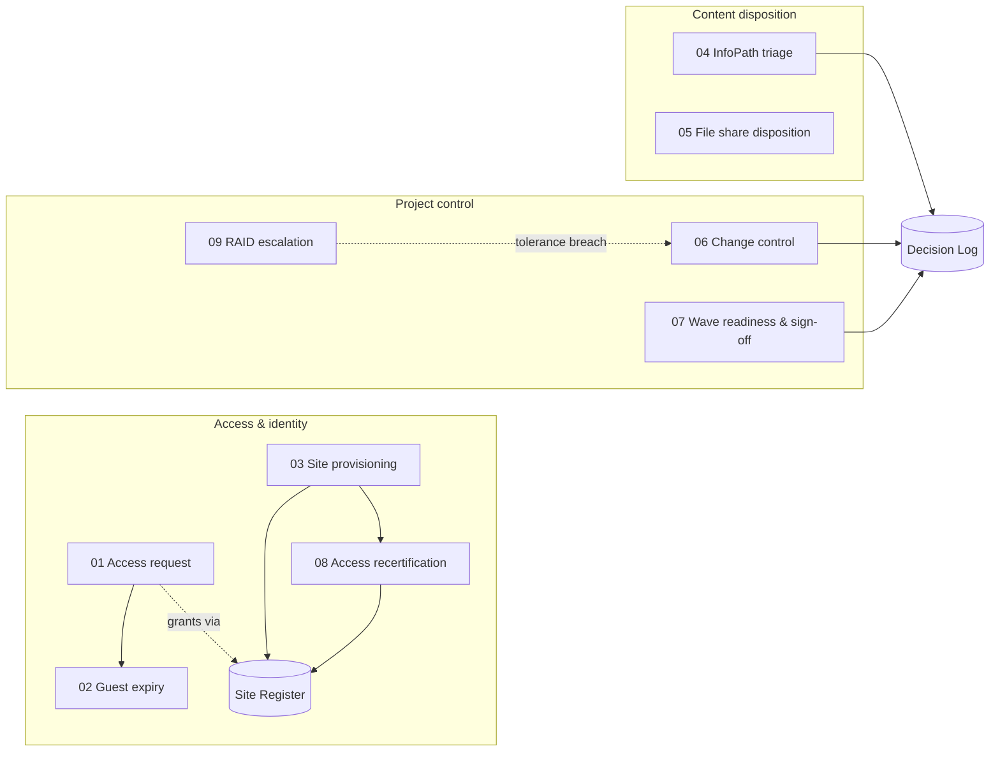
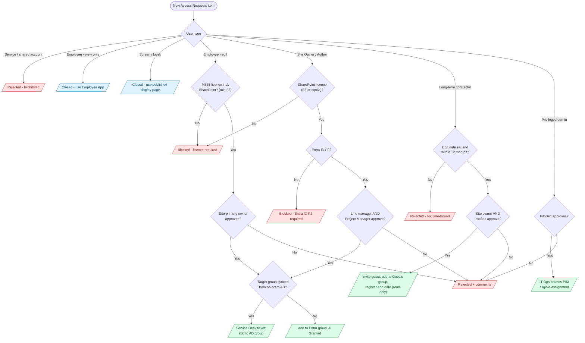
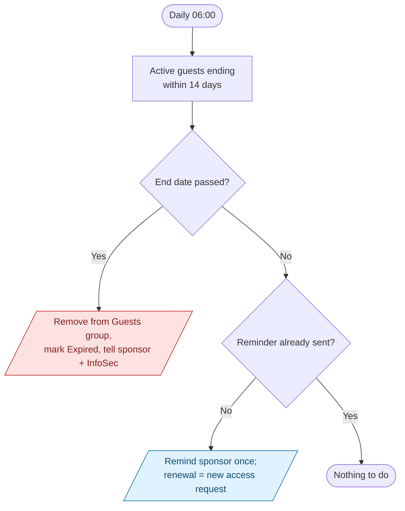
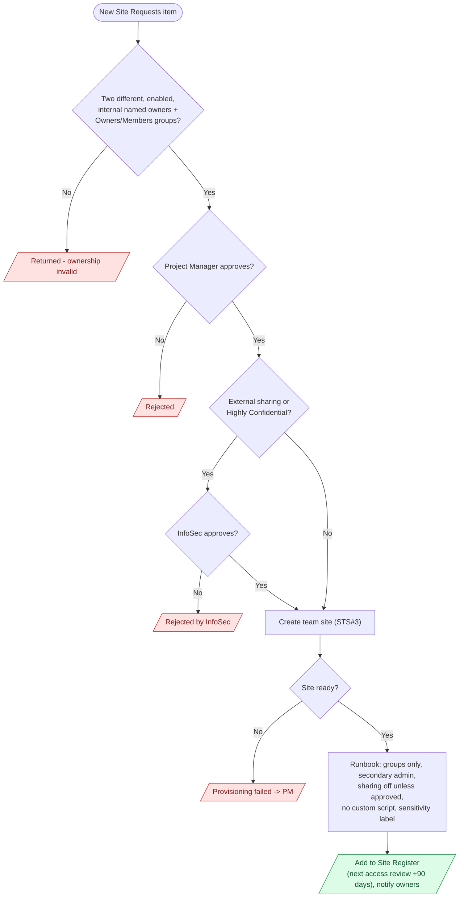
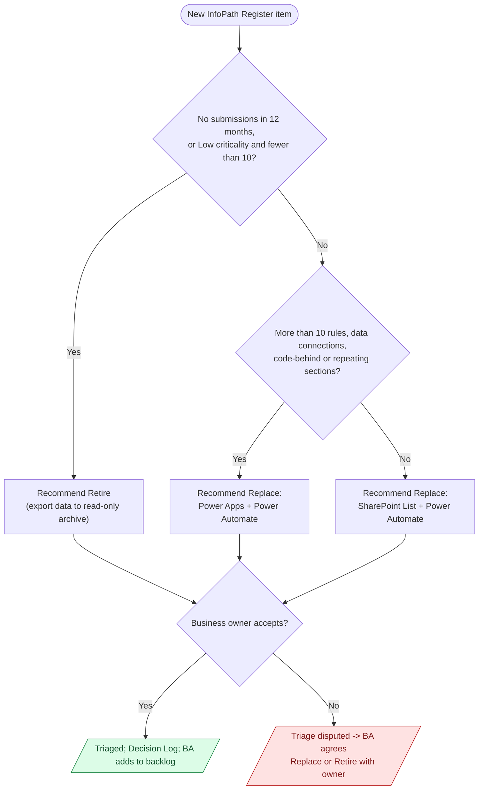
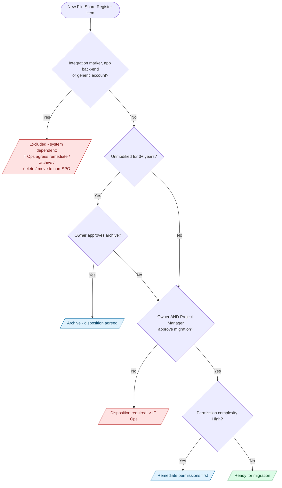
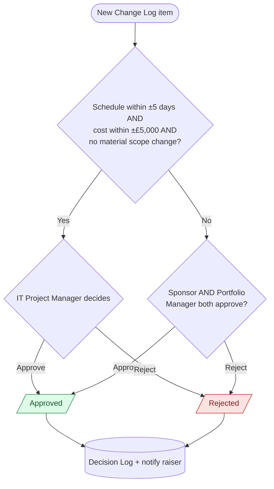
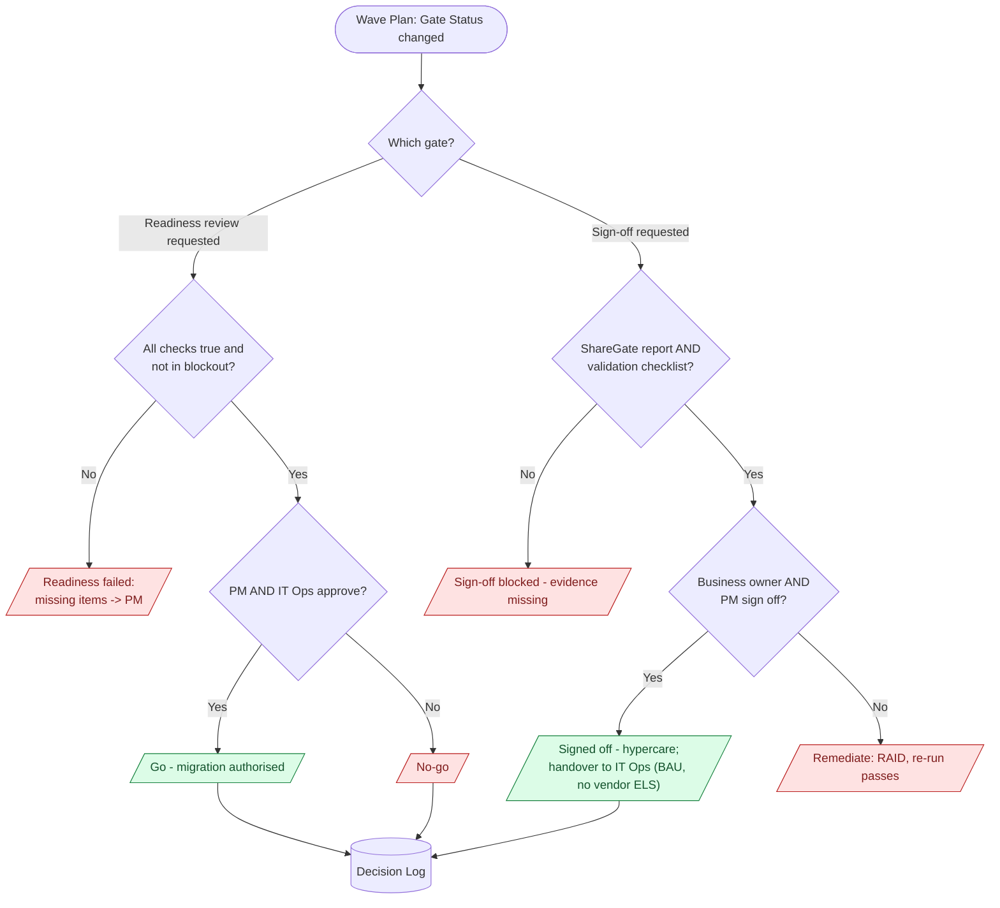
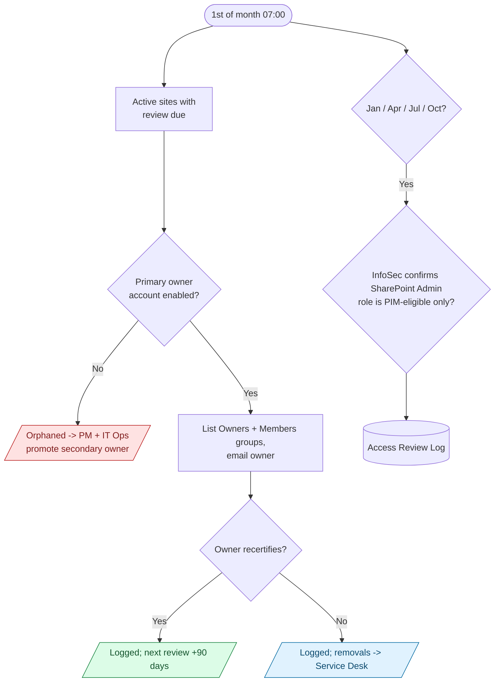
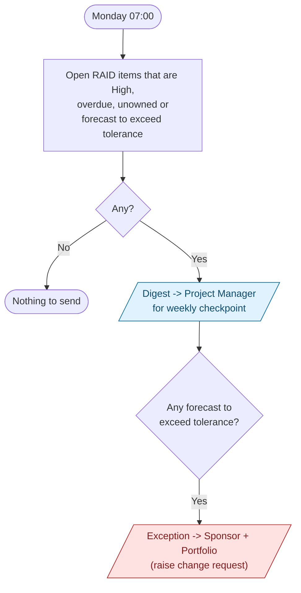

# SharePoint governance flows — process diagrams

One diagram per flow in `../powerautomate/flows/`. Each diagram shows the
decision the flow enforces and who approves it. Green ends are grants or
approvals, red ends are blocks or rejections. Role names map to people in
[`../README.md`](../README.md#roles).

## Overview

## 01 — Access request (Access Method Decision Table)

## 02 — Guest access expiry (daily)

## 03 — Site provisioning

## 04 — InfoPath triage (Replace / Retire, never as-is)

## 05 — File share disposition (selective migration)

## 06 — Change control (tolerance-based authority)

## 07 — Wave readiness and sign-off

Readiness checks: prerequisites DEP001–DEP005, ShareGate licence, site
owners confirmed, permission baseline approved, digital spring clean, site
owner comms (2 weeks before), super users briefed (1 week before), Service
Desk briefed, peer-tenant window agreed.

## 08 — Access recertification (monthly; 90-day cycle per site)

## 09 — RAID weekly escalation

